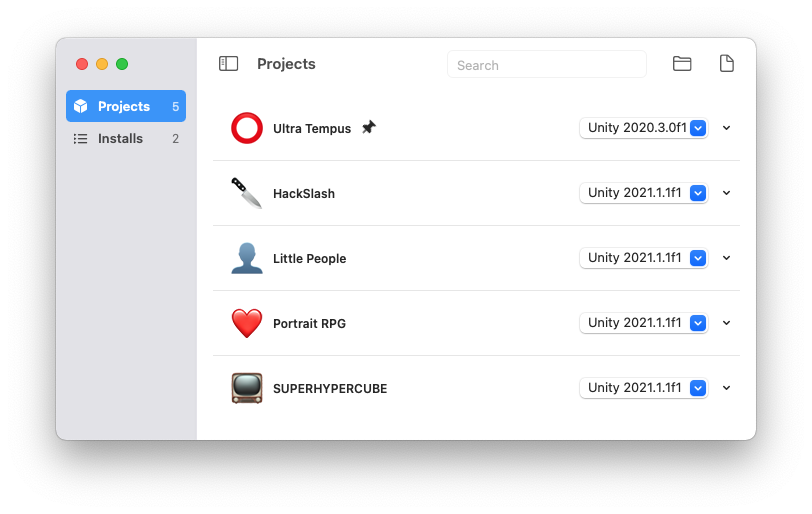

# Unity Hub (Swift)
A Unity Hub alternative, built natively for macOS.

## Features
(The official app doesn't have features tagged with ✨!)
✨ Fully native UI and technology (no Electron!), loads instantly
✨ Smaller visual footprint
✨ Add custom project icons for quick identification
✨ View useful project information without opening in Unity
✨ Enhanced project search
✨ Open projects without adding them to the list
✨ Automatically quit after opening a project
✨ Quickly add multiple projects at once

- Find Unity versions with default and custom locations
- Get installed modules per Unity version via modules.json
- Load projects, added via manual location
- Install Unity versions and modules (requires official [Unity Hub](https://unity3d.com/get-unity/download) for CLI tools)
- Default Unity version for new projects
- Version uninstall
- ✨ Single module uninstall
- ✨ File size display for projects, versions, and modules

 
 

## Tips
**Hiding the official Unity Hub application from the dock**
- Locate Unity Hub.app in the Applications folder
- Right click > Show Package Contents
- Open Info.plist, located in the Contents folder, with Xcode
- Add a new property, titled `LSUIElement` and set the value to `YES`
- If Unity Hub is open, quit it and make sure it's not in the dock
